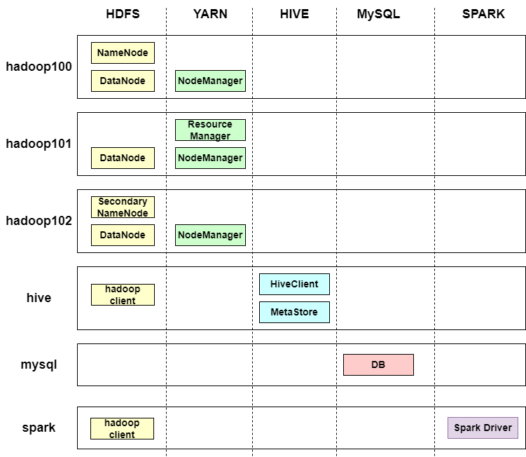

# Hadoop Docker

Hadoop docker project is used to build and start up a big data cluster in some docker containers. It is a convenient tool to try and test the big data components. Currently the components we support includes:
- [Apache Hadoop](https://hadoop.apache.org/)
- [Apache Hive](https://hive.apache.org/)


## Overview


The big data components are optional while starting up the cluster.
- For the hadoop component, there are 3 nodes whose hostnames are `hadoop100`, `hadoop101` and `hadoop102`.
- For the hive component, there are one node whose hostname is `hive`, and hive component depends on the `mysql` node.

## Prerequisite
- docker, docker-compose
- make
- sed
- curl

## Usage

### 1. build images
```
git clone git@github.com:wecharyu/hadoop-docker.git
cd hadoop-docker
make build target=hadoop
```
The `target` option is used to specify the component your cluster want, whose default value is `hadoop`, the optional value include `hadoop` and `hive`.

### 2. startup cluster
- use the Makefile script:
```
make run target=hadoop
```
- restart existed containers
```
docker-compose start
```
You can easily change the component version for your requirements in the `Makefile` file. Further more, if you want to test the non-community release version, i.e. components modified and compiled by yourself, you can place your compiled tarball in `packages` directory, **do not forget to keep the version number same as configuration in `Makefile`**.
### 3. stop containers
- remove containers when stopping:
```
docker-compose down
```
- stop containers which can be restarted
```
docker-compose stop
```
### 4. get into containers
```
docker exec -u root -it hadoop100 bash
```
You can use `su` command to switch to other user in this container, for example you can use `su hadoop` in hadoop container.

## Access web ui from host broswer

- HDFS UI: [http://localhost:9870](http://localhost:9870)
- YARN UI: [http://localhost:8088](http://localhost:8088)
